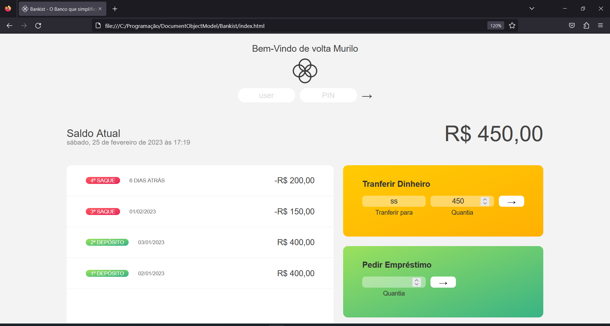
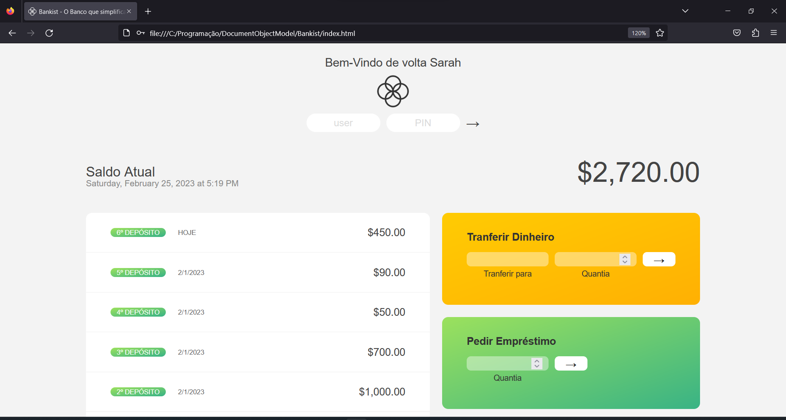
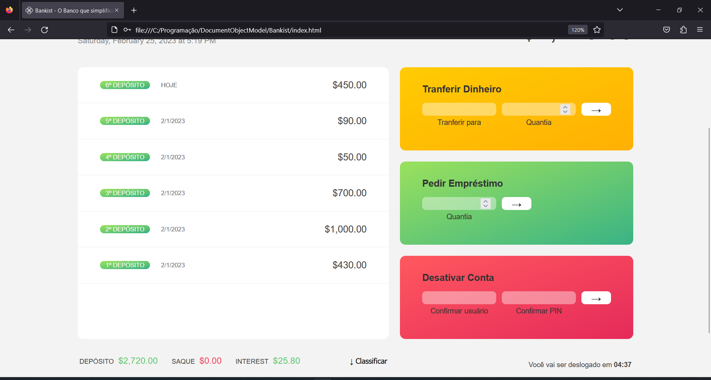

# Bankist

Veja online: https://murilo-sanches.github.io/bankist/

## Sobre
**Bankist**, o Banco que Simplifica. Projeto sem nenhum intuito comercial/sério, apenas para manipular a DOM e aperfeiçoar os conhecimentos de JavaScript/TypeScript. 
Programado de forma imperativa. 

O projeto contém 5 contas ativas (ver mais no `index.ts`), em cada conta possue as informações de movimentos (saques/depósitos), além 
do local e da moeda que o "usuário" utiliza porque foi utilizado a API `Intl` do próprio JavaScript para controlar o fluxo de dinheiro e data . Com essas 
informações o JavaScript controla a DOM para responder de acordo com o respectivo usuário logado. Todas as informações estão no **PRÓPRIO ARQUIVO**, não 
foi utilizado back-end, banco de dados ou localstorage, apesar do fato que seria fácil implementar algo mais real, meu objetivo foi apenas a 
manipulação do Front-End.

**Login Data:**
```
Murilo Sanches - username: ms && pin: 9999 - pt-BR, BRL

Pedro Garcia - username: pg && pin: 1111 - pt-PT, EUR

Omar Ali - username: oa && pin: 2222 - ar-EG, USD

Steven Thomas Williams - username: stw && pin: 3333 - en-GB, GBP 

Sarah Smith - username: ss && pin: 4444 - en-US, USD 
```

### Conteúdos  
* [Sobre](#sobre)  
* [Tecnologias](#tecnologias)  
* [Quick Start](#quick-start)  
* [File Tree](#file-tree)  
* [Screenshots](#screenshots)  

## Tecnologias
* HTML
* CSS
* TypeScript

## Quick Start
**Visualizar**
* Baixar o repositório
* Descompactar a pasta
* Copiar o caminho do index.html e colocar na URL do navegador

**Modificar**
* Caso queira alterar, certifique-se que tenha uma versão do Node instalada, caso não tenha: https://nodejs.org/en/
* Tenha o TypeScript baixado globalmente, caso não tenha: `npm install -g typescript`
* Dentro de **./src** comece a modificar o arquivo index.ts e transforme o código em JS com `tsc` no terminal, ou `tsc -w` para atualizar automaticamente

Se caso houver algum erro no terminal relacionado a políticas de segurança, execute os comandos no CMD ou no próprio PowerShell com os comandos seguidos de 
".cmd" - 
```
tsc.cmd -w
```

## File Tree
```
.
├── public/
│   ├── assets/
│   │   └── ...
│   ├── css/
│   │   └── style.css
│   └── js/
│       └── script.js
├── src/
│   └── index.ts
│   └── login.txt
├── .prettierrc
├── index.html
└── tsconfig.json
```

## Screenshots




